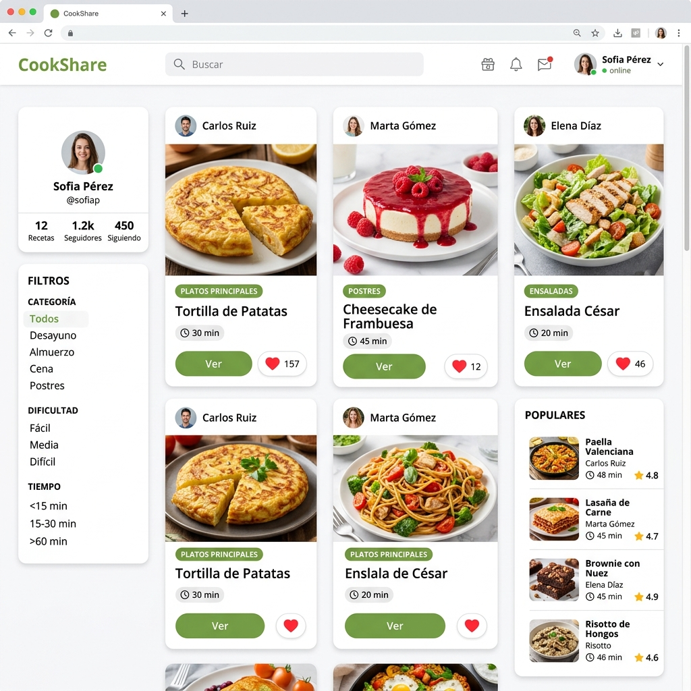
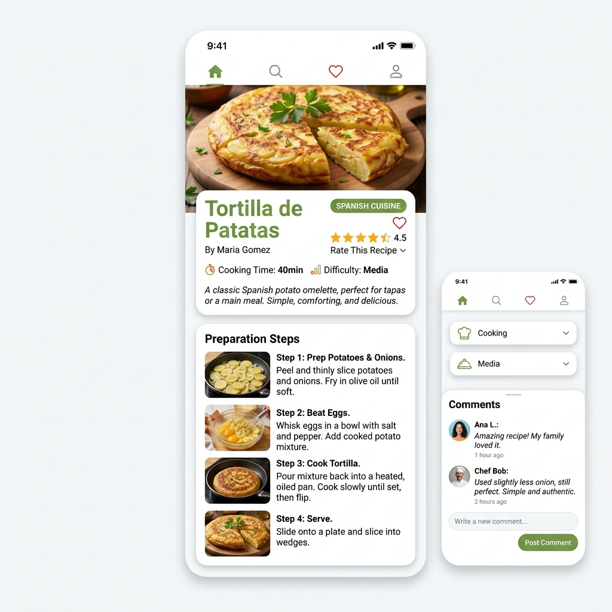
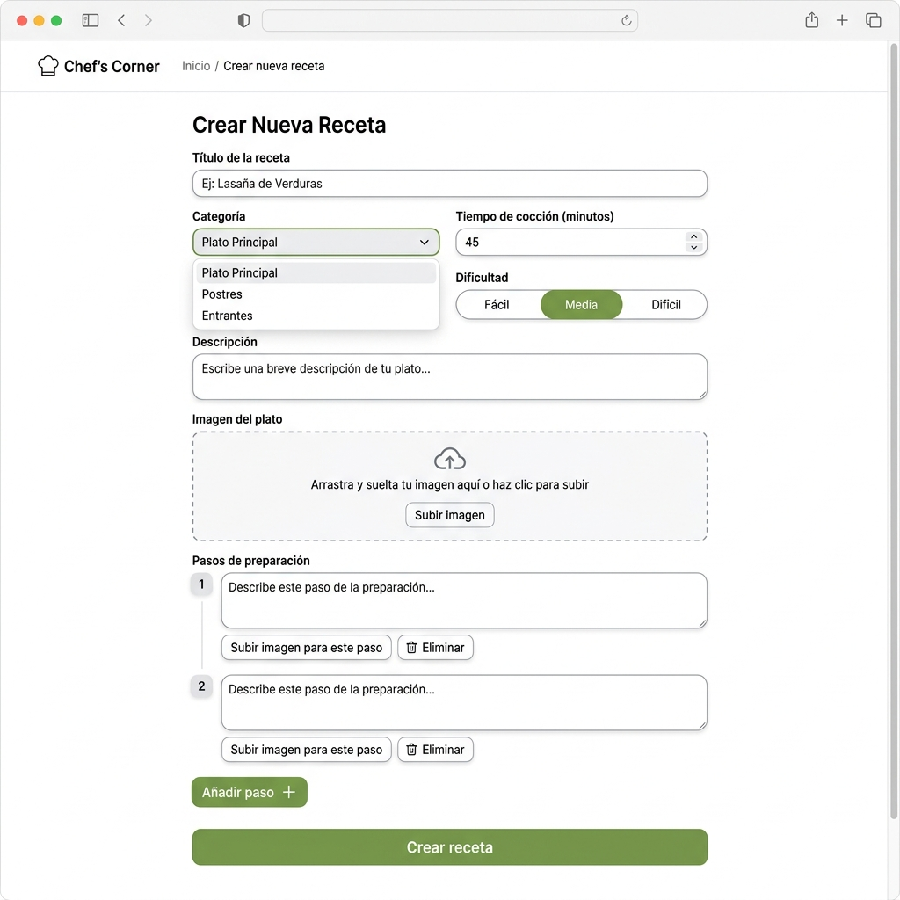

# Guía de uso — Recetas Fáciles

Bienvenido a **Recetas Fáciles**, una red social de cocina donde puedes publicar, descubrir y valorar recetas de otros usuarios.

### Capturas de pantalla

#### Feed principal

#### Detalle de receta

#### Crear receta

---

## Registro e inicio de sesión

1. Haz clic en **Registrarse** en la barra de navegación.
2. Rellena tu nombre, email y contraseña.
3. Una vez registrado, iniciarás sesión automáticamente.
4. Para volver a entrar, usa **Iniciar sesión** con tu email y contraseña.

---

## Navegación por el feed

Al entrar en la página principal verás el **feed de recetas**:

- Si **no estás logueado**, verás todas las recetas publicadas.
- Si **estás logueado y sigues a otros usuarios**, verás las recetas de las personas a las que sigues y las tuyas propias.
- El feed tiene **scroll infinito**: al llegar al final, se cargan más recetas automáticamente.

### Filtros disponibles

En el sidebar izquierdo (o el botón "Filtros" en móvil) puedes filtrar por:

| Filtro | Opciones |
|---|---|
| **Categoría** | Veganos, Carnívoros, Dulceros |
| **Dificultad** | Fácil, Media, Difícil |
| **Tiempo** | ≤15 min, 16-45 min, 46-90 min, +90 min |
| **Orden** | Recientes, Antiguos, Más rápidos, Más lentos |

### Búsqueda

Usa la barra de búsqueda en la navegación para buscar por título, descripción, autor o categoría. La búsqueda es en tiempo real (sin recargar la página).

---

## Publicar una receta

1. Haz clic en **Publicar** o en el campo "¿Qué has cocinado hoy?".
2. Rellena los campos:
   - **Título** (obligatorio)
   - **Categoría** (obligatoria)
   - **Tiempo de cocción** en minutos
   - **Dificultad**
   - **Descripción** (opcional)
   - **Imagen principal** (obligatoria)
   - **Pasos de preparación** (al menos 1)
   - **Imágenes de los pasos** (opcionales)
3. Haz clic en **Crear receta**.

---

## Ver una receta

Haz clic en **Ver** en cualquier tarjeta del feed. En la página de detalle podrás:

- Ver la imagen, pasos e ingredientes.
- **Valorar** la receta (de 1 a 5 estrellas).
- **Comentar** compartiendo tu opinión.
- **Guardar en favoritos** con el botón de corazón.

---

## Interacciones sociales

### Favoritos
- Haz clic en el icono ❤️ en cualquier tarjeta o detalle de receta.
- Tus favoritos aparecen en tu **Dashboard**.

### Valoraciones
- En el detalle de una receta, selecciona una puntuación (1-5) y pulsa **Votar**.
- Puedes cambiar tu valoración en cualquier momento.

### Comentarios
- Escribe tu opinión en el formulario del detalle (máximo 500 caracteres).
- Los comentarios aparecen en tiempo real sin recargar.

### Seguir usuarios
- Visita el perfil de un usuario haciendo clic en su nombre.
- Pulsa **Seguir** para ver sus recetas en tu feed.
- Puedes dejar de seguir en cualquier momento.

---

## Tu perfil

### Dashboard
Accede desde la barra de navegación → **Dashboard**. Aquí verás:
- Tus recetas publicadas.
- Tus recetas favoritas.

### Editar perfil
En **Perfil** puedes cambiar:
- Tu nombre.
- Tu email.
- Tu avatar (foto de perfil).
- Tu descripción.

### Notificaciones
Recibirás notificaciones cuando:
- Alguien comente en tu receta.
- Alguien valore tu receta.
- Alguien te siga.

Accede a tus notificaciones desde el icono 🔔 en la barra de navegación.

---

## Editar y eliminar recetas

- Solo puedes **editar o eliminar tus propias recetas**.
- Los botones de editar (✏️) y eliminar (🗑️) aparecen en las tarjetas de tus recetas.
- El administrador puede editar y eliminar cualquier receta.
